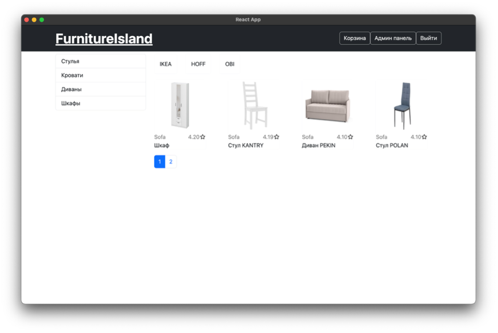
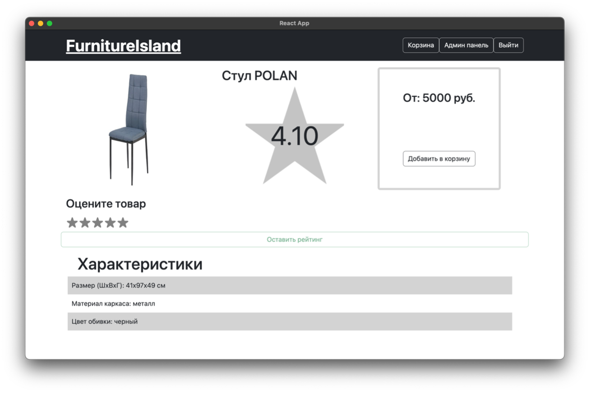
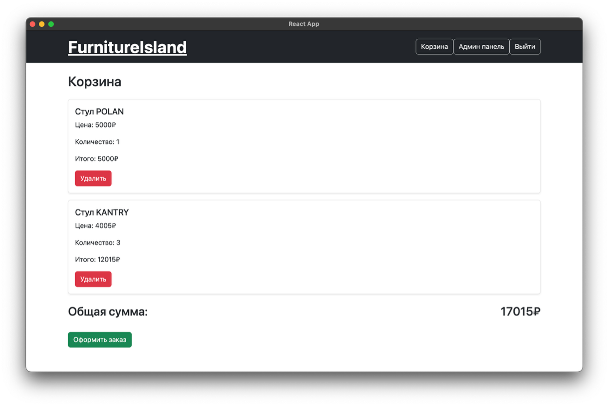

# 🪑 Online Furniture Store App

Добро пожаловать в проект **онлайн-каталога мебели**, предоставляющий удобный и интуитивно понятный интерфейс для покупателей и сотрудников компании.  

---

## 📦 Описание проекта

В системе представлены товары различных категорий, которые можно просматривать и приобретать через клиентское приложение. Сотрудники компании имеют доступ к управлению ассортиментом, заказами и данными клиентов.  

Задача автоматизированной информационной системы (АИС) — структурировать большие объёмы информации и обеспечить быстрый, надёжный доступ к ключевым элементам платформы.

> 🧩 Благодаря интуитивному интерфейсу, система подходит как для специалистов, так и для пользователей без технического опыта.

---

## 🛠️ Используемые технологии

| Компонент | Технология |
|----------|------------|
| 💾 База данных | **PostgreSQL** |
| ⚙️ Серверная логика | **Node.js** |
| 🎨 Клиентский интерфейс | **React** |
| 🖥️ Десктоп-приложение | **Electron** |

---

## 📸 Интерфейс (пример)

---

### 🛋️ 1. Главный вид онлайн-каталога мебели

На главной странице отображается каталог с товарами, фильтрами и категориями. Пользователь может просматривать ассортимент и добавлять понравившиеся позиции в корзину.



---

### 📦 2. Страница с определённым товаром

При переходе на конкретный товар открывается его подробное описание, изображения, характеристики и кнопка "Добавить в корзину".



---

### 🛒 3. Страница корзины

Пользователь может изменить количество товаров, удалить позиции и оформить заказ.  
При нажатии на кнопку **"Оформить заказ"** — автоматически формируется и скачивается PDF-файл с деталями заказа.



---

---

## 🚀 Возможности

- Просмотр и фильтрация мебели по категориям
- Регистрация и авторизация пользователей
- Оформление и отслеживание заказов
- Панель администратора для управления товарами и заказами
- Кроссплатформенное приложение (Windows/macOS/Linux)

---

## ⚙️ Запуск проекта локально

1. **Клонируй репозиторий**

```bash
git clone https://github.com/ElvinCool/Online-Furniture-store-app.git
cd Online-Furniture-store-app
